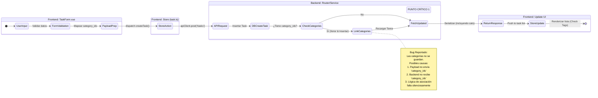
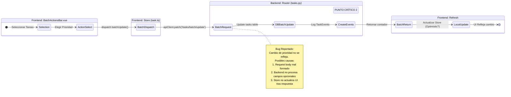

# Diagrama de Flujo de Componentes (Análisis de Bugs)

Este diagrama modela el flujo de estados de las transacciones afectadas (Creación de Tarea y Acciones Batch) para ayudar a identificar el punto de fallo en `apptodo-b77`.

## 1. Creación de Tarea con Categoría

## 2. Acciones Batch (Cambio de Prioridad)

